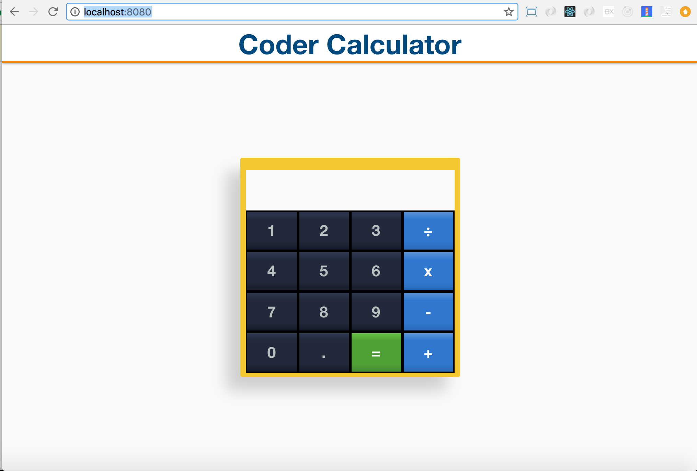

# PREACT CALCULATOR 

I built this app as part of a coding challenge for a Frontend Developer postion with a startup in downtown Austin. This app is a simple calculator using Preact, CSS-Grid, and Flexbox.

## Table of contents

* [quick start](#installation)

* [design concepts](#design)

* [technology used](#specs)

* [testing and build process](#tests)

## Installation

To test or view this app on your local machine, clone this repository. Navigate to your newly cloned repository and run the following commands:

  * `yarn`

Or alternatively for the NPM user:

  * `npm install`

Then run:
  
  * `yarn start`

Or alternatively for NPM users:

  * `npm start`

Navigate to [http://localhost:8080/](http://localhost:8080/) and have fun!

  * If for some reason it doesn't run correctly, you may need to globally install the preact-cli.

## Design

No design specs were provided for this challenge. I was given free reign to design as I pleased. Keeping in mind the job for which I was applying, I opted to cater my product to the client. As such, the color scheme, palette, and even favicon are intentionally similar to their homepage. (The idea being that the client has already displayed a preference for this design scheme as they've chosen the exact same design for their production website. It also displays attention to detail.)

Here are photos for comparision.

* Original website

* Calculator App

I used this coding challenge as an opportunity to play with the new native CSS Grid (something I've been meaning to do for a while). CSS Grid is amazing, but apparently it's near impossible to pass grid-area properties as props. 

I also used flexbox to center the content and elements. I am a huge fan of flexbox and strongly prefer it over other third-party grid solutions or using floats for element positioning. 

This app is also probably the first time I've had a justifiable use case for the calc() feature! I'm using calc() to set the main page height equal to 100vh minus the height of the header bar and a bottom offset to ensure the elements don't overlap.

Throughout the design process, I attempted to adhere to some basic UI design principles as outlined here https://medium.com/@erikdkennedy/7-rules-for-creating-gorgeous-ui-part-1-559d4e805cda
 
## Specs

This app uses:

* CSS native grid

* Flexbox

* Preact

* Preact-router 

* Preact CLI

* Mocha

* Chai

* ESlint

The CSS native grid is pretty impressive, although browser support can be lacking in older browsers. It is apparently incredibly difficult to pass CSS styles as props to other nested components. Especially when each child component requires a unique position attribute to work with CSS native grid. Evaluating string type props into a reference for CSS class styling fails. Even when using examples straight out of Preact documentation. CSS-Grid doesn't accept strings as grid-area arguments. My program can't discern between a CSS var reference and a JS reference.

Flexbox is amazing and has better browser support than CSS native Grid. No more need be said about it.

Preact is an interesting technology. I like that it's lightweight, I also like its fast functionality and that it's a near perfect match for React but with an MIT license. I do feel like some of the build tools for it are lacking when compared to the React ecosystem.

Preact-router in this app is just a minimalistic setup. I have not dealt with it enough to talk about it in depth.

Preact CLI's setup fails out of the box on both their lack of a test command and a badly configured ESlint setup (or code written by them that violates their own validation rules). Testing setup is lacking and I had to configure my own (more on this later). For any build system config the use of karma is just about mandatory from what I gather. Their build command also fails.  

I use mocha and chai for my test suite setup. It's a time tested classic.

ESlint was included out of the box (failing, will be covered in more detail later).

All application logic in contained in the calculator component. All others are pure/functional components. Had I needed to build a more complex app, MOBX or Redux would have been in order. 

MOBX or Redux would also have helped with function testing. I initially attempted to decouple the logic from the component, but it's difficult to preserve the context of 'this' in regards to logic that modifies state. Hence I opted to write the logic in the component directly. Importing methods that require state awareness from a separate file without a context of state unnecessarily complicates things (it's overkill anyways as we only have a few methods in this application).

On the topic of state, the JavaScript eval() WILL NOT ACCEPT A NON-STRING OPERAND. It'll handle integers just fine, but unquote an operand and so help you god your application is doomed! I'm handling all calculation-critical data in the state as a string to ensure that this does not happen.

On a random note, this app run from localhost curently scores higher on lightbox evaluation in ALL 4 categories of PWA, Performance, Accessibility, AND Best practices when compared to the clients current production website.

I attempted to keep additional dependencies at a minimum during application development. 

## Tests

The test suite can be run with `yarn test` or `npm test`. The test suite assumes a global mocha install on your machine.

The Preact library itself has open issues related to testing = [https://github.com/developit/preact/issues/658](https://github.com/developit/preact/issues/658)  Their workaround is to use a little known library called [https://github.com/developit/preact-jsx-chai/](https://github.com/developit/preact-jsx-chai/) unfortunately that library didn't seem to work for me. 

The testing config is a pain. Babel configs are hidden by preact-cil. Cannot access  config. Getting "unexpected token 'import' even when I place the test file in the same dir as the component itself." Tests will have to wait. Done over again, I'd have to implement another alternative to allow for separated function testing.

On the topic of testing, here's a ton of issues related to it:

  * [https://github.com/developit/preact-compat/issues/233](https://github.com/developit/preact-compat/issues/233)

  * [https://github.com/developit/preact/issues/146](https://github.com/developit/preact/issues/146)

  * [https://gist.github.com/robertknight/88e9d10cff9269c55d453e5fb8364f47](https://gist.github.com/robertknight/88e9d10cff9269c55d453e5fb8364f47) (sadly, the lack of intuitive webpack configuration and setup still leads to failure with this method)

  * [https://github.com/developit/preact/issues/658](https://github.com/developit/preact/issues/658) (OPEN ISSUE, difficult preact test setup is a known problem with no current solution.)

  * [https://github.com/developit/preact/issues/560](https://github.com/developit/preact/issues/560) (touches on how Preact is opinionated and requires karma as another dependency.)

  * [https://gist.github.com/developit/9b0bb57b3e001de67814c7f4de9cbfbf](https://gist.github.com/developit/9b0bb57b3e001de67814c7f4de9cbfbf) (This was what I attempted first. No luck with that one either.)

  * [https://preactjs.com/guide/unit-testing-with-enzyme](https://preactjs.com/guide/unit-testing-with-enzyme) (Their documentation is literally one section. And offers no alternative to their exact karma setup.)

And on linting, the ESlint fails out-of-the-box. I indent using 4 spaces. ESlint preact default plugin is set to tabs which is causing errors to be thrown. Regardless, the testing setup runs and is in place to plug-and-play any eslint config setup. I'd be able to instantly re-configure this setup to match any client specific requirements.

## Known problems

* Hitting '.' repeatedly causes an error. /* so please don't do this :) */
